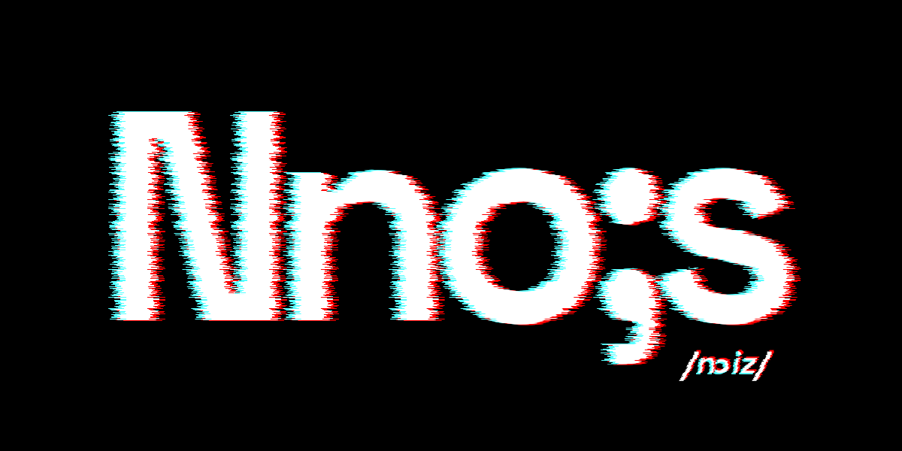
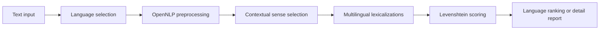

<p align="center">
  
</p>

<p align="center">

  <strong>Normalized Natural-language Orthographic Index of Similarity</strong><br>
  A multilingual orthographic transparency analysis tool

</p>

### The Engine

**N**ormalized **N**atural-language **O**rthographic **I**ndex of **S**imilarity

Nnois compares a source-language word, or the nominal content of a text, with lexicalizations of the same concept in other languages. It combines language detection, OpenNLP preprocessing, contextual sense disambiguation, multilingual lexical data, and normalized Levenshtein similarity to estimate **orthographic transparency across languages**.

### The Promise

> **Nnois: No Isolation in Language.**

Nnois is designed around a simple idea: linguistic distance should not have to mean social distance. By revealing recognizable forms and lexical similarities across languages, Nnois can help learners discover connections between what they already know and what they are learning.

### The Name

Pronounced **/nɔɪz/** — *noise*.

The name deliberately evokes the apparent noise of an unfamiliar language: unfamiliar words, unfamiliar spellings, and unfamiliar forms. Nnois turns that apparent noise into measurable patterns of similarity.

**From unfamiliar words to recognizable patterns.  
From recognizable patterns to understanding.  
From understanding to connection.**

> Nnois measures **orthographic similarity**, not proven etymological relatedness. A high score indicates similar written forms for entries representing the same selected sense; it does not establish that the forms are historical cognates.

## Highlights

- Analyze a word in context and compare its selected sense across languages.
- Analyze multi-word input automatically through nouns and validated noun phrases.
- Explore all available senses and translations for a single word.
- Select the source language automatically or manually with ISO 639-1/ISO 639-2 codes.
- View aggregate language rankings or an optional unit-by-unit report.
- Read language output in terminal colors inspired by associated national flags.

## What It Can Be Used For

- **Contrastive linguistics:** explore how words that express a selected sense differ in written form across languages.
- **Lexical-semantic research:** inspect context-sensitive sense selection and the lexicalizations attached to the selected concept.
- **Vocabulary exploration:** use the single-word sense explorer to examine definitions, near-equivalent forms, and multilingual lexical alternatives.
- **Second-language acquisition:** identify familiar-looking vocabulary between a learner's known language and a target language, then use the contextual analysis to discuss when apparent form similarity aligns with meaning.
- **Language-learning material design:** inspect a text's nominal vocabulary and use the aggregate detail report to select cross-linguistic comparison examples for a lesson or activity.
- **Corpus and text exploration:** obtain a compact, language-by-language orthographic profile of the nominal content of a short text.

For second-language acquisition, Nnois is most useful as a prompt for guided comparison: learners can test hypotheses about form and meaning, notice spelling correspondences, and investigate false friends. Its scores do not measure word frequency, pronunciation, grammatical difficulty, communicative usefulness, or whether an apparent similarity has a shared historical origin.

## Requirements

- Java 21 or a compatible JDK
- Maven 3.8+
- Multilingual lexical SQLite data at `nnois/src/main/resources/omw/omw_multilingual.db`

Language-specific OpenNLP models improve tokenization, POS tagging, noun-phrase extraction, and lemmatization. The Maven configuration includes models for English, Italian, German, French, Spanish, Portuguese, and Dutch; the application falls back where models are unavailable.

## Quick Start

```bash
cd nnois
mvn clean package
mvn exec:java -Dexec.mainClass=com.nnois.App
```

You can also run `com.nnois.App` directly from an IDE after marking `src/main/resources` as a resources root.

## Using The CLI

Enter text at the prompt. Use `exit` or `quit` to finish; use `back` during language selection to return to text entry.

```text
Input text > tree
Language [1/2] > 1
```

A one-word input opens the sense explorer. It lists the candidate senses, their glosses, and translations grouped by language.

For sentences or longer text, choose an analysis mode:

```text
1) Chosen-word transparency in context
2) Aggregate nominal transparency (no chosen word)
```

### Chosen-Word Analysis

Choose mode `1`, then provide a single word from the text. Nnois uses the sentence context and part-of-speech evidence to select the most likely lexical sense, then ranks target-language lemmas by transparency.

```text
Language: ita | Lemma: albero               | Transparency: 0.33
Language: fra | Lemma: arbre                | Transparency: 0.20
```

### Aggregate Nominal Analysis

Choose mode `2` to extract nominal units automatically. Nnois disambiguates each extracted noun or validated noun phrase and adds its transparency contributions for every target language.

```text
[Contrastive] Nominal aggregate mode | Nominal units: 4 | Analyzed units: 4
[Nominal Aggregate] Total score: 4.00 | Units: 4
Language: ita | Transparency: 0.60
Language: fra | Transparency: 0.47
Show detailed report [y/N] > y
```

The optional detailed report groups each contribution by nominal unit and shows the destination language, translated lemma, and individual score.

## Understanding Scores

### Individual Token Scores

For source form $s$ and target lemma $t$, Nnois calculates normalized Levenshtein similarity:

$$
T(s,t) = 1 - \frac{d(s,t)}{\max(|s|, |t|)}
$$

where $d(s,t)$ is the edit distance between normalized forms. Individual scores range from `0.00` to `1.00`:

| Score | Meaning |
| ---: | --- |
| `1.00` | Identical normalized forms |
| `0.90–0.99` | Very similar; minor spelling differences |
| `0.70–0.89` | Recognizable; clear orthographic overlap |
| `0.50–0.69` | Partial similarity; some character correspondence |
| `0.20–0.49` | Weak similarity; limited overlap |
| `0.00–0.19` | Minimal similarity; few shared characters |

### Aggregate Scores

In aggregate nominal mode, scores are **normalized by the number of analyzed units**:

$$
A_{\ell}(X) = \frac{1}{n} \sum_{u \in U(X)} T(u, t_{u,\ell})
$$

where $n$ is the count of analyzed nominal units and $t_{u,\ell}$ is the selected lexicalization in language $\ell$. This produces a **0.00 to 1.00 range** comparable to single-token scores, allowing fair comparison across texts of different lengths.

**Example:** A text with 4 analyzed units where Italian contributes scores of 0.80, 0.60, 0.50, and 0.40 yields:
$$A_{ita} = \frac{0.80 + 0.60 + 0.50 + 0.40}{4} = 0.575$$

The optional detailed report shows individual unit contributions so you can trace back which nominal elements drove the aggregate ranking.

### How to Read Scores

- **Use individual scores** to identify potentially cognate-like forms or to notice spelling correspondences for vocabulary learning.
- **Compare aggregate scores** to see which languages have the most recognizable nominal vocabulary in a given text.
- **Inspect the detailed report** to understand which concepts (nouns and noun phrases) account for high or low aggregate scores in each language.
- **Do not assume high scores indicate translation quality, pronunciation similarity, or historical relatedness.** Nnois measures visible orthographic form under a shared sense constraint.

### Levenshtein Distance Calculation

The edit distance is computed by dynamic programming. For prefixes of source form $s$ and target form $t$, the recurrence is:

$$
D(i,j) = \min\begin{cases}
D(i-1,j) + 1 & \text{deletion} \\
D(i,j-1) + 1 & \text{insertion} \\
D(i-1,j-1) + [s_i \ne t_j] & \text{substitution}
\end{cases}
$$

with $d(s,t) = D(|s|, |t|)$. Before this calculation, the implementation lowercases and trims both forms. It therefore measures visible similarity in the normalized spelling, rather than pronunciation or morphology in the abstract.

## Linguistic Method

Nnois is a contrastive lexical-analysis tool. It first determines which linguistic unit is being compared, then measures how similar its written form is to lexicalizations of the same meaning in other languages.

### From Text To Lexical Unit

- **Tokenization** separates the input into word-like units.
- **Part-of-speech tagging** distinguishes likely nouns, verbs, adjectives, and adverbs. In aggregate mode, nouns and proper nouns are the primary evidence-bearing units.
- **Lemmatization** reduces inflected forms to a dictionary form when a language model is available. This limits superficial differences such as number or verbal inflection.
- **Noun-phrase chunking** detects multi-word nominal expressions. A phrase is retained as one unit only when it is attested in the lexical data; otherwise its component nouns remain separate.

### Sense In Context

Many word forms are polysemous: the same spelling can represent several meanings. Nnois uses a Lesk-style approach to reduce this ambiguity. It compares normalized context words with the glosses of candidate senses, after filtering stopwords and applying any available POS preference. The candidate with the strongest overlap supplies the shared lexical concept used for cross-language comparison.

Let $C(w)$ be the set of usable, lemmatized context terms around source lemma $w$, excluding $w$ itself. For each candidate sense $\sigma$, let $G(\sigma)$ be the usable terms from its gloss. The primary contextual score is:

$$
L(\sigma, w) = |C(w) \cap G(\sigma)|
$$

Nnois selects the candidate with the greatest $L(\sigma,w)$. If a POS is inferred from the input, candidates with that POS are preferred before scoring. When candidates remain tied or no gloss overlaps with the context, the native pipeline applies a deterministic fallback: noun, verb, adjective, adverb, then stable synset ordering. This makes repeated analysis reproducible for the same data and input.

### Reading Across Languages

Once a sense $\sigma^*$ has been selected, Nnois retrieves its lexicalizations in each destination language $\ell$. It does not compare every word in one language against every word in another. Instead, it compares forms only after they have been associated with the same selected concept:

$$
K(\sigma^{}, \ell) = {t \mid t \text{ lexicalizes } \sigma^{} \text{ in language } \ell}
$$

Each candidate form $t \in K(\sigma^*,\ell)$ receives $T(w,t)$. The ranked result is therefore a **cross-linguistic reading of orthographic form under a shared sense constraint**. It can highlight visibly similar lexicalizations, including potential cognate-like forms, but it cannot distinguish inherited cognates, borrowings, chance resemblance, transliteration effects, or language-specific spelling conventions.

For aggregate nominal analysis, the language profile is the normalized sum of unit-level scores:

$$
A_{\ell}(X) = \frac{1}{n} \sum_{u \in U(X)} T(u, t_{u,\ell})
$$

where $t_{u,\ell}$ is a lexicalization linked to the sense selected for unit $u$. The detailed report exposes these individual contributions so that a language-level total can be read back through its nominal evidence.

### Weighted Extended Lesk

The local WordNet analysis pathway also implements a weighted extended Lesk variant. Its sense signature combines direct-gloss terms, hypernym and hyponym glosses, and verb-frame examples. For a context-term frequency $f_C(x)$ and a signature weight $W_\sigma(x)$, it calculates:

$$
L_w(\sigma, C) = \sum_{x \in C} f_C(x) \cdot W_\sigma(x)
$$

The current weights are `2.0` for direct gloss terms, `1.0` for hypernym and hyponym glosses, and `1.5` for verb-frame examples. Ties are resolved by direct-gloss matches, the WordNet sense number, then the synset identifier. This pathway preserves repeated context terms through $f_C(x)$, whereas the native multilingual path uses set overlap.

The result should be read as a context-sensitive comparison of lexical forms. It is not a translation-quality judgment, a measure of phonetic similarity, or an etymological classifier.

## Processing Pipeline



1. The application detects or accepts the source language.
2. OpenNLP tokenizes, tags, and lemmatizes the text when corresponding models are available.
3. For contextual analysis, a Lesk-style disambiguator chooses the best lexical sense.
4. Aggregate mode identifies nominal tokens and validated noun phrases, then repeats the analysis for each unit.
5. Lemmas linked to the selected sense are scored and ranked by language.

## Supported Language Codes

The pipeline normalizes common ISO 639-2 codes for OpenNLP while resolving the final source language against the available lexical data.

| ISO 639-2 | ISO 639-1 |
| --- | --- |
| `eng` | `en` |
| `ita` | `it` |
| `fra` | `fr` |
| `deu` | `de` |
| `spa` | `es` |
| `por` | `pt` |
| `nld` | `nl` |

Use automatic detection for ordinary text and manual selection when working with short, mixed-language, or ambiguous input.

## Building the OMW Database

The multilingual lexical database is created from the [Open Multilingual Wordnet (OMW)](https://github.com/omwn/omw-data) project. To build `omw_multilingual.db` from source:

```bash
# Clone the OMW data repository
git clone https://github.com/omwn/omw-data.git
cd omw-data

# Use the omw-database utility (included in this project)
cd ../omw-database
mvn clean package

# Run the database builder, specifying the OMW data directory
mvn exec:java -Dexec.mainClass=com.nnois.db.OmwDatabaseBuilder \
  -Dexec.args="/path/to/omw-data/omw"

# Copy the resulting omw_multilingual.db to the Nnois resources
cp omw_multilingual.db ../nnois/src/main/resources/omw/
```

See the `omw-database/README.md` for detailed builder options and schema information.

## Project Layout

```text
Nnois/
├── nnois/              Java/Maven application
│   ├── src/main/java/  CLI, NLP, disambiguation, and scoring
│   └── src/main/resources/
│       └── omw/        OMW SQLite database
├── omw-data/           Utilities and source data for OMW preparation
└── omw-database/       Database creation utility
```

## Troubleshooting

| Problem | What to check |
| --- | --- |
| Database cannot be found | Confirm that `omw_multilingual.db` is present under `src/main/resources/omw/`. |
| Language detection is unreliable | Use a longer input or select a source language manually. |
| No senses are returned | Check the source lemma, selected language code, and the `synset_lemmas` lexical-data table. |
| No nominal units are detected | Verify that the tokenizer and POS model for the source language are available. |
| Colors render as text | Run the CLI in an ANSI-compatible terminal. |

## Attributions

Nnois depends on open lexical resources and libraries. See [Attributions.md](Attributions.md) for the complete resource and software credits.

Key resources:

- **Open Multilingual Wordnet (OMW):** https://github.com/omwn/omw-data ([OMW License](https://github.com/omwn/omw-data/blob/master/LICENSE))
- **Apache OpenNLP:** https://opennlp.apache.org/ ([Apache License 2.0](https://www.apache.org/licenses/LICENSE-2.0))
- **Language Detector (langdetect):** https://github.com/shuyo/language-detection ([Apache License 2.0](https://www.apache.org/licenses/LICENSE-2.0))
- **WordNet:** https://wordnet.princeton.edu/ ([WordNet License](https://wordnet.princeton.edu/license-and-download))

## License

The Nnois source code is licensed under the [GNU General Public License](LICENSE). Linguistic data, language models, and software dependencies included or used by the project remain subject to their own license terms and notices, summarized in [Attributions.md](Attributions.md).

## Development

Run the Maven test suite from the Java module:

```bash
cd nnois
mvn test
```

The SQLite connection is owned by the active pipeline and is closed with it. Native NLP resources are cached by normalized language code for the duration of the session.

---

## Citation

If you use Nnois in academic work, please cite the accompanying thesis:

```
Esposito, P. (2026). Nnois: Normalized Natural-language Orthographic Index of Similarity.
Doctoral thesis, University of Salerno.
```

The official thesis record is available in the University of Salerno's institutional repository (IRIS): [https://www.iris.unisa.it/handle/11386/4938058](https://www.iris.unisa.it/handle/11386/4938058)

---